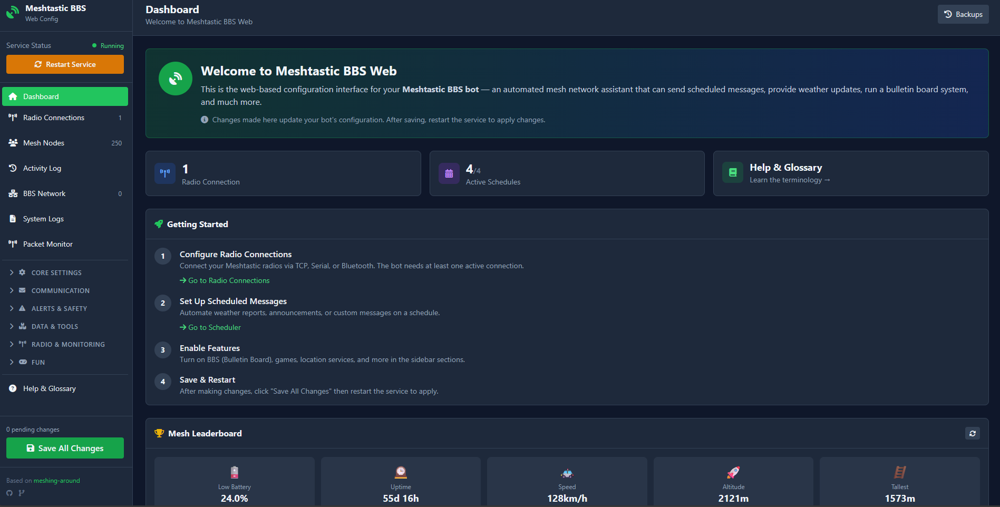
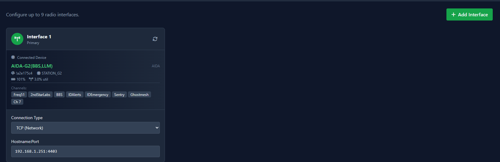
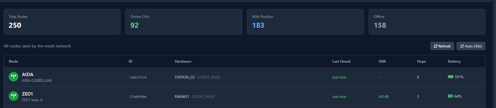
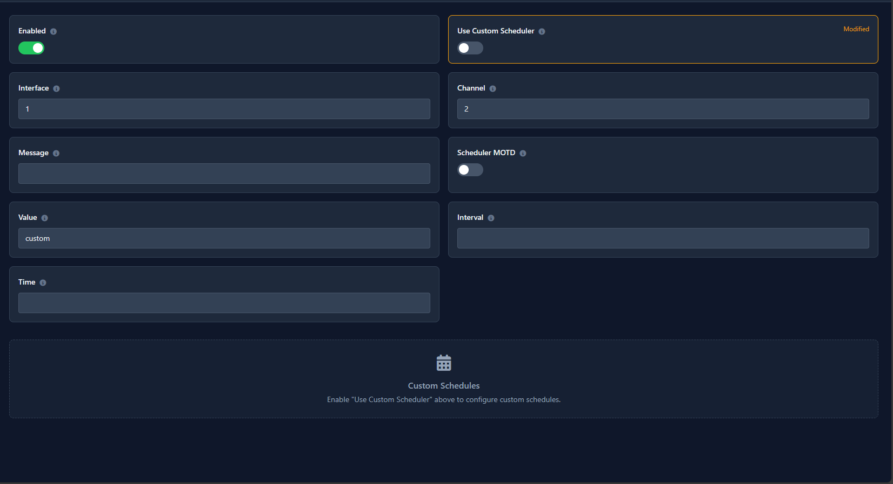
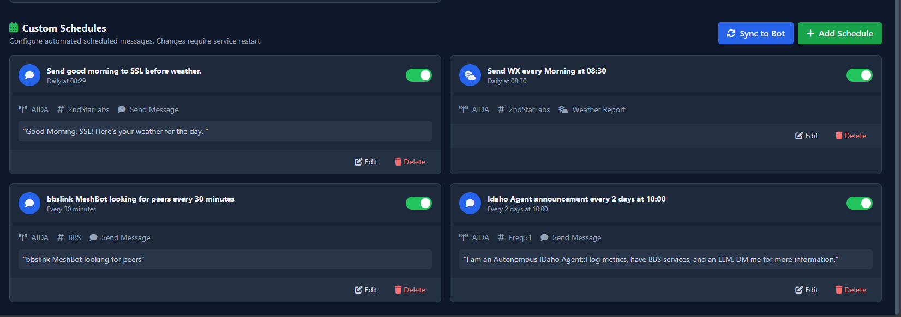
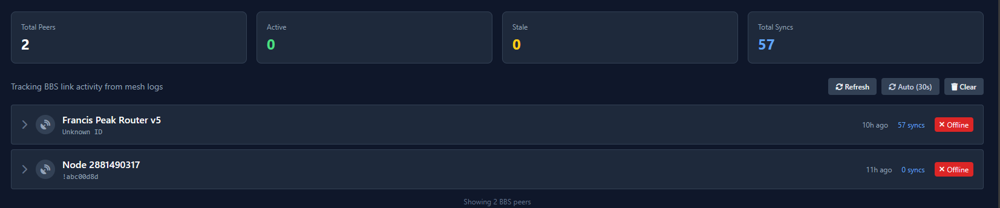
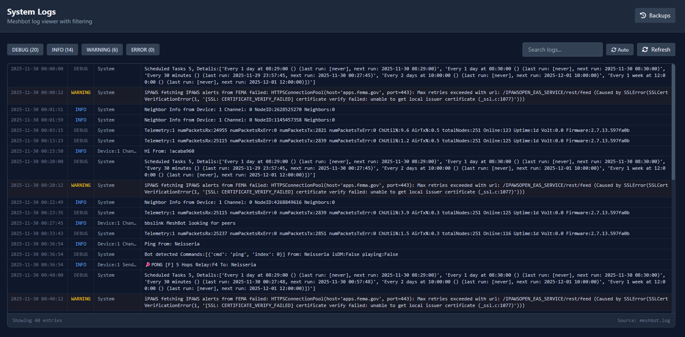
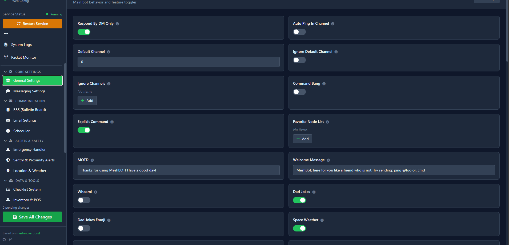
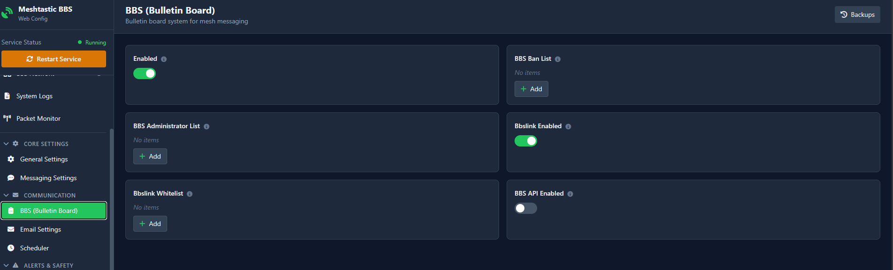
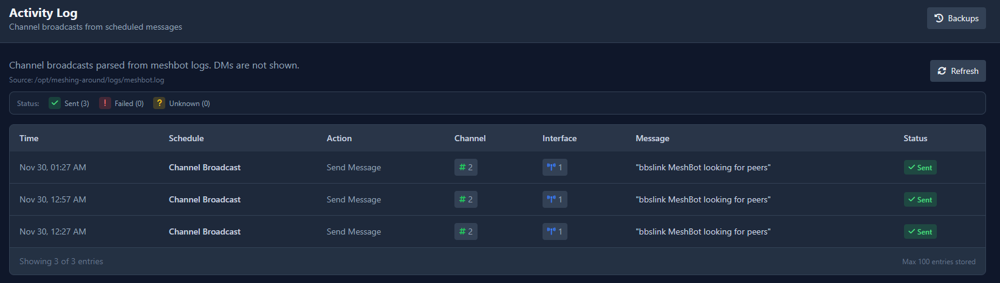

# Meshing-Around WebGUI

Web-based configuration and monitoring interface for the Meshing-Around Meshtastic BBS bot.

## Upstream Relationship

This WebGUI is built on top of [SpudGunMan/meshing-around](https://github.com/spudgunman/meshing-around).

**Current status: NOT a standalone addon.**

The WebGUI requires modifications to core files (`mesh_bot.py` and `modules/system.py`), meaning you cannot install vanilla meshing-around and then drop in the WebGUI as an addon.

## Modifications to Upstream

### 1. `mesh_bot.py` - Packet Buffer for WebGUI Monitoring

Adds ~225 lines for real-time packet capture and buffering. This enables the Packet Monitor feature in the WebGUI.

```python
# Added: Thread-safe packet buffer
PACKET_BUFFER_PATH = os.environ.get("PACKET_BUFFER_PATH", "/app/data/packets.json")
MAX_PACKETS = 100  # Keep last 100 packets
_packet_buffer = deque(maxlen=MAX_PACKETS)
_buffer_lock = Lock()

# Added: Portnum to human-readable name mapping
PORTNUM_NAMES = {
    'TEXT_MESSAGE_APP': 'Text',
    'POSITION_APP': 'Position',
    'NODEINFO_APP': 'NodeInfo',
    # ... etc
}

# Added: debug_packet_inspection() function
def debug_packet_inspection(packet, interface, rxType, rxNode=1):
    """Parse packet and write to buffer for WebGUI monitoring."""
    # Captures packet details, resolves node names, writes to JSON buffer
```

**Impact:** Adds packet monitoring capability. Requires `DEBUGpacket = True` in config.ini.

### 2. `modules/system.py` - `saveLeaderboard()` function

Adds node names (shortName/longName) to leaderboard entries when saving to pickle file. This allows the WebGUI to display human-readable names instead of just hex node IDs.

```python
# Added: resolve node names before saving
short_name = get_name_from_number(entry['nodeID'], 'short', 1)
long_name = get_name_from_number(entry['nodeID'], 'long', 1)
entry['shortName'] = short_name if short_name else None
entry['longName'] = long_name if long_name else None
```

**Impact:** Non-breaking addition. Leaderboard data gains optional name fields.

### 3. `modules/system.py` - `retry_interface()` function

Fixes TCP hostname:port parsing bug. Original code didn't properly handle `hostname:port` format for TCP interfaces.

```python
# Added: parse host:port format
if isinstance(host, str) and ':' in host:
    maybe_host, maybe_port = host.rsplit(':', 1)
    if maybe_port.isdigit():
        host = maybe_host
        port = int(maybe_port)
```

**Impact:** Bug fix. Allows TCP connections with custom ports.

## Making This a Standalone Addon

To make the WebGUI installable on vanilla meshing-around:

| Option | Description |
|--------|-------------|
| **PR upstream** | Submit the system.py changes to SpudGunMan. If merged, WebGUI becomes a drop-in addon. |
| **Remove dependency** | Modify WebGUI to work without system.py changes. Leaderboard would show hex IDs only. |
| **Auto-patch** | Have addon installation script patch system.py. Fragile, breaks on upstream updates. |

**Recommended approach:** Submit PRs upstream for:
1. TCP hostname:port fix (legitimate bug fix)
2. Leaderboard node names (minor enhancement)
3. Packet buffer/debug inspection (new feature)

Once merged, the `webgui/` directory becomes a pure addon.

## Features

- **Dashboard** - Service status, quick stats, leaderboard
- **Radio Connections** - Configure up to 9 Meshtastic interfaces (Serial/TCP/BLE)
- **Scheduler** - Manage scheduled broadcasts and messages
- **Mesh Nodes** - View all nodes seen by the mesh network
- **BBS Network** - Track BBS peer synchronization
- **Packet Monitor** - Real-time packet inspection (requires DEBUGpacket)
- **System Logs** - Filterable log viewer with auto-refresh
- **Configuration** - All config.ini sections with validation

## Screenshots

### Dashboard


### Radio Connections


### Mesh Nodes


### Scheduler



### BBS Network


### System Logs


### Configuration



### Activity Log


## Running

The WebGUI runs as a FastAPI application, typically via Docker:

```bash
docker-compose up -d meshing-webgui
```

Default port: 8085

## Files

```
webgui/
├── main.py              # FastAPI application
├── config_schema.py     # Configuration field definitions
├── templates/
│   └── index.html       # Single-page application (Tailwind CSS)
├── schedules.json       # Scheduler data
└── README.md            # This file
```
